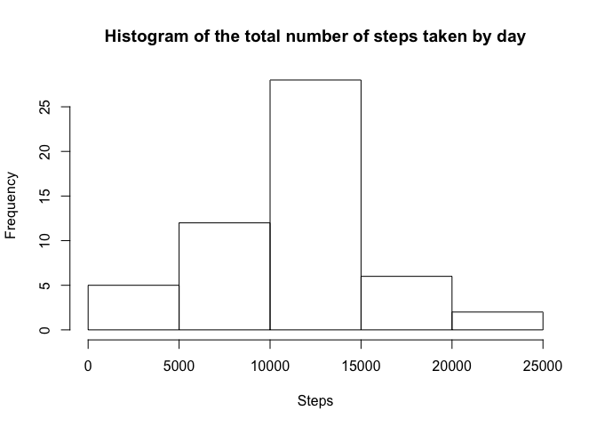

# Reproducible Research: Peer Assessment 1


## Loading and preprocessing the data

```r
raw_data <- read.csv(file = 'activity.csv')
head(raw_data)
```

```
##   steps       date interval
## 1    NA 2012-10-01        0
## 2    NA 2012-10-01        5
## 3    NA 2012-10-01       10
## 4    NA 2012-10-01       15
## 5    NA 2012-10-01       20
## 6    NA 2012-10-01       25
```

```r
str(raw_data)
```

```
## 'data.frame':	17568 obs. of  3 variables:
##  $ steps   : int  NA NA NA NA NA NA NA NA NA NA ...
##  $ date    : Factor w/ 61 levels "2012-10-01","2012-10-02",..: 1 1 1 1 1 1 1 1 1 1 ...
##  $ interval: int  0 5 10 15 20 25 30 35 40 45 ...
```


## What is mean total number of steps taken per day?
Total number of steps taken per day:

```r
steps_each_day <- aggregate(x = raw_data$steps, by = list(raw_data$date), FUN = sum)
names(steps_each_day) <- c('date', 'steps')
head(steps_each_day)
```

```
##         date steps
## 1 2012-10-01    NA
## 2 2012-10-02   126
## 3 2012-10-03 11352
## 4 2012-10-04 12116
## 5 2012-10-05 13294
## 6 2012-10-06 15420
```

```r
str(steps_each_day)
```

```
## 'data.frame':	61 obs. of  2 variables:
##  $ date : Factor w/ 61 levels "2012-10-01","2012-10-02",..: 1 2 3 4 5 6 7 8 9 10 ...
##  $ steps: int  NA 126 11352 12116 13294 15420 11015 NA 12811 9900 ...
```

Histogram of the total number of steps taken each day:

```r
hist(steps_each_day$steps, main = 'Histogram of the total number of steps taken by day', xlab = 'Steps')
```

 

Mean of the total number of steps taken per day:

```r
mean(steps_each_day$steps, na.rm = TRUE)
```

```
## [1] 10766.19
```

Median of the total number of steps taken per day:

```r
median(steps_each_day$steps, na.rm = TRUE)
```

```
## [1] 10765
```


## What is the average daily activity pattern?

```r
by_interval <- aggregate(raw_data$steps, list(raw_data$interval), mean, na.rm = TRUE)
names(by_interval) <- c('date', 'steps')
plot(by_interval$date, 
     by_interval$steps, 
     type = 'l', 
     main = 'Average number of steps taken, averaged across all days', 
     xlab = '5-minute interval', ylab = 'Avg. number of steps taken')
```

 

Which 5-minute interval, on average across all the days in the dataset, contains the maximum number of steps?

```r
by_interval[by_interval$steps == max(by_interval$steps), ]
```

```
##     date    steps
## 104  835 206.1698
```


## Imputing missing values
Total number of missing values in the dataset:

```r
sum(is.na(raw_data$steps))
```

```
## [1] 2304
```


## Are there differences in activity patterns between weekdays and weekends?
